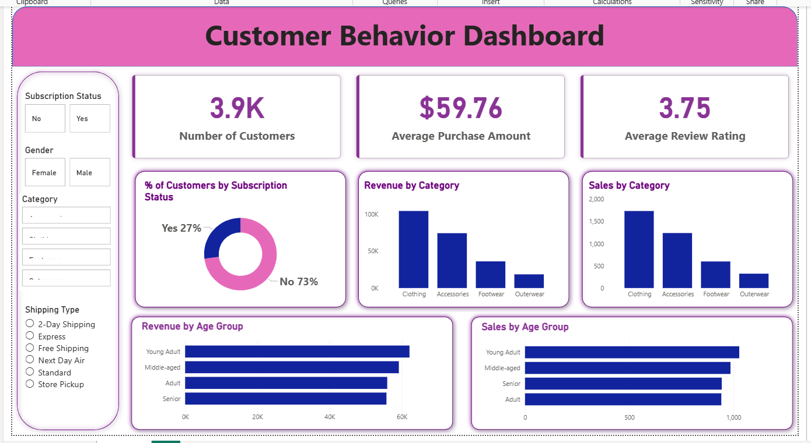

# 🛍️ Customer Shopping Behavior Analysis  
### End-to-End Data Analytics Project | Python • PostgreSQL • Power BI  

---

## 📊 Dashboard Preview

---

## 📌 Project Overview

This project analyzes **3,900 customer transactions** to uncover insights into customer spending behavior, subscription impact, product performance, and revenue drivers.

The goal was to transform raw transactional data into actionable business insights using a complete end-to-end data analytics workflow.

---

## 🧾 Dataset Summary

- **Rows:** 3,900  
- **Columns:** 18  
- **Missing Values:** 37 (Review Rating column – handled using median imputation)

The dataset includes customer demographics, purchase details, discount usage, subscription status, shipping type, and review ratings.

---

## 🔎 Project Workflow

**1️⃣ Data Cleaning & Feature Engineering (Python)**
- Data preprocessing using Pandas  
- Missing value treatment  
- Column standardization  
- Created `age_group` and customer segmentation features  

**2️⃣ Database Integration (PostgreSQL)**
- Loaded cleaned data into PostgreSQL  
- Performed structured SQL business analysis  

**3️⃣ SQL Business Insights**
- Revenue by gender  
- Subscribers vs non-subscribers comparison  
- High-spending discount users  
- Top-rated products  
- Shipping type impact  
- Customer segmentation (New, Returning, Loyal)  
- Revenue by age group  

**4️⃣ Power BI Dashboard**
- Interactive KPI dashboard  
- Revenue & sales breakdown by category and age group  
- Subscription distribution analysis  
- Dynamic filters for better exploration  

---

## 📈 Key Insights

- Male customers generated higher total revenue.
- Young Adults contribute the highest revenue share.
- Certain products are highly discount-dependent.
- Express shipping users show slightly higher spending behavior.
- Majority of customers fall into the "Loyal" segment.

---

## 🎯 Business Recommendations

- Strengthen subscription incentives.
- Optimize discount strategies for margin protection.
- Promote top-rated and best-selling products.
- Focus marketing on high-revenue age groups.
- Enhance loyalty reward programs.

---

## 🛠 Tech Stack

- **Python (Pandas)**
- **PostgreSQL**
- **SQL (Aggregations, CTEs, Window Functions)**
- **Power BI**
- Data Cleaning & Business Analytics

---

## 💡 Skills Demonstrated

✔ Data Cleaning & Preparation  
✔ Feature Engineering  
✔ SQL Business Analysis  
✔ Customer Segmentation  
✔ Dashboard Design  
✔ Insight Communication  

---

## 🚀 Project Impact

This project demonstrates the ability to convert raw data into strategic business decisions through structured analysis and visual storytelling.

---

⭐ If you found this project interesting, feel free to connect with me!
